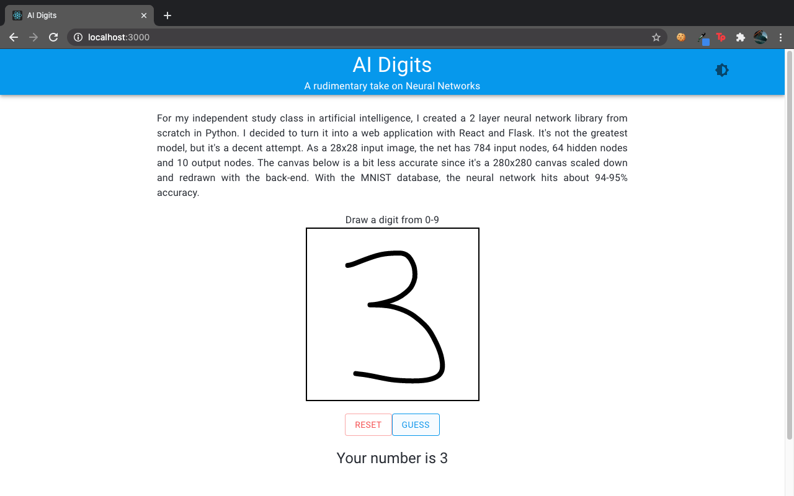
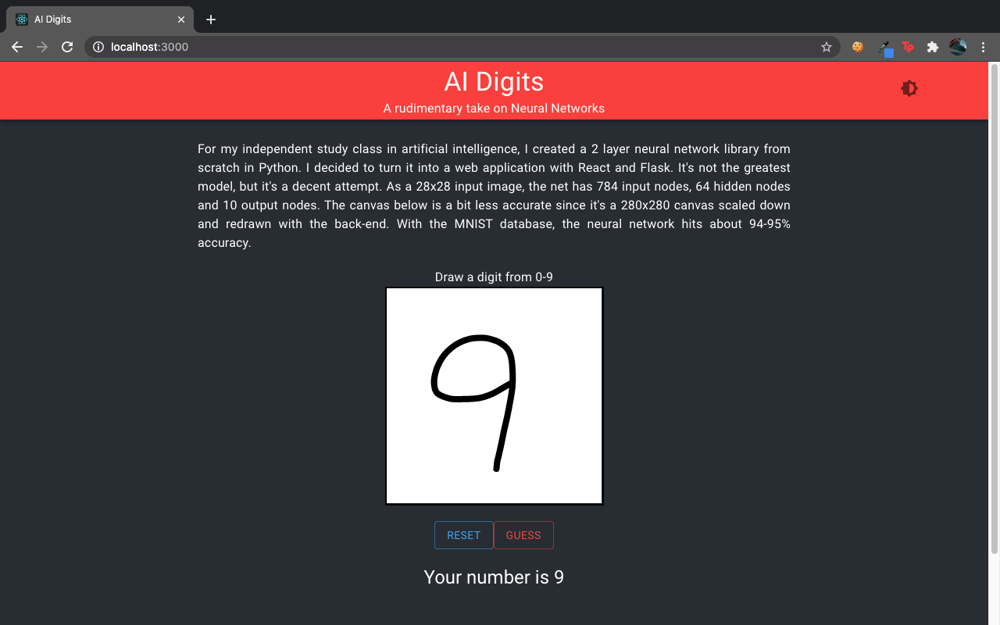

# AI-Digits
A React-Flask Web App that implements my Neural Network library with the MNIST database of handwritten digits.

## 😄 Summary 
For my Independent Study - AI Class, I decided to interface with the neural network library I created in Python through a web application. The application lets you draw a digit and feed that to a trained neural network. It attempts to classify what digit you drew. The results were... decent😬 .Turns out passing stringified image data to a back end is harder than it looks. 

## 💻 Tech 
The UI is done with React and Material-UI. There's a wonderful node module called react-canvas-draw (https://www.npmjs.com/package/react-canvas-draw) that had exactly what I was looking for. It was my first attempt at learning it so I was pretty happy with the results. The Neural Network used is in my other repository (https://github.com/rNuv/Artificial-Neural-Network). I used pickle to store a trained instance of the class. The backend is done with Flask. I made a simple endpoint to handle the request from React, which has the stringified json image data (probably could have handled this better). And I also used material-ui's theme provider to add a light and dark mode. 

## 📷 Pictures

